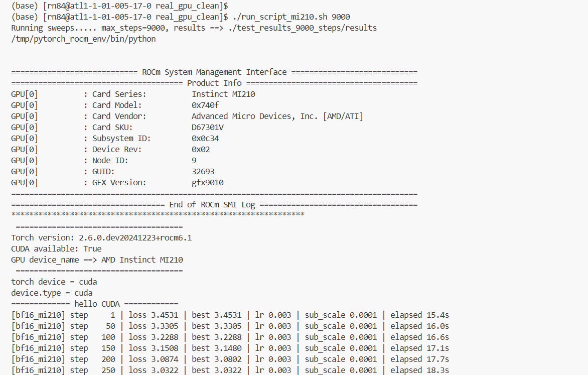

# Real GPU Training Experiments

Minimal codebase for running floating-point format experiments on real GPU hardware (NVIDIA and AMD).

## Files

- `sweep_lr_real_vendor_job.py` - Main training script using PyTorch AMP
- `real_tiny_gpt_model.py` - Tiny GPT model definition'
- `install_cuda_torch.sh` - Installs PyTorch built for CUDA 12.1 (NVIDIA GPUs).
- `install_rocm_torch.sh` - Installs nightly (pre-release) PyTorch built for ROCm 6.1 (AMD GPUs).
- `run_script_a100.sh` - Nvidia A100
- `run_script_mi210.sh` - AMD MI210
- `merge_real_gpu_results.py` - Script to aggregate results from all jobs
- `plot_graphs.py` - Plots loss saturation
- `README.md` - This file

## Steps

### Remove results
```
rm -rf testing_3000_steps/
rm -rf plots_3000_steps/
```


### A100 GPU 

```
salloc --gres=gpu:A100:1 --ntasks-per-node=4

cd real_gpu_clean/

export USER=<your user name>
./install_cuda_torch.sh 

# specify steps(i.e., 3000) as an argument
./run_script_a100.sh 3000
```


### MI210 GPU 

```
salloc --gres=gpu:MI210:1 --ntasks-per-node=4

cd real_gpu_clean/

export USER=<your user name>
./install_rocm_torch.sh 

# specify steps(i.e., 3000) as an argument
./run_script_mi210.sh 3000
```

Output: 
Output: 

##### Note:
 - there are 6 runs in the above script (3 fp16 + 3 bf16);
 - Comment the runs if required
 - results written to "testing_3000_steps/results/"


### Merge Results:

```
module load pytorch

PYTHONNOUSERSITE=1 python merge_real_gpu_results.py --output-dir  test_results_3000_steps/
```

### Plot graphs
```
python plot_graphs.py --result-file test_results_3000_steps/merged_results.pkl --output-dir plots_3000_steps
```